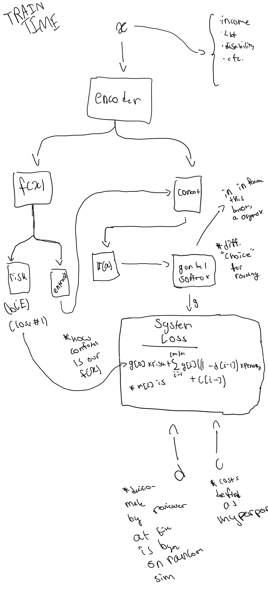

# HARP: Human-Aware Routing Policies for Multi-Stage Decision Pipelines




## Run the data pipeline
please run from root:
```
chmod +x harp/scripts/data.sh

harp/scripts/data.sh harp/config/data_config.yaml
```
